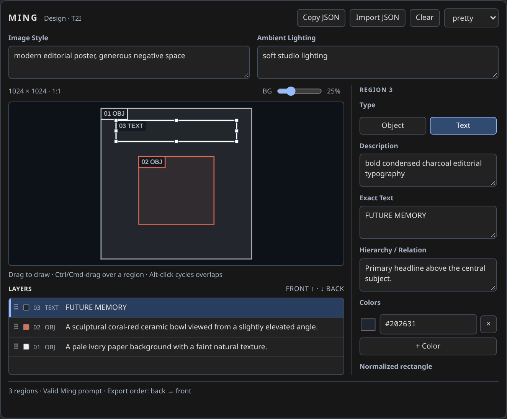

# Ming Image Prompt Builder

A visual structured-prompt editor for **Ming-Image-0.1-Design text-to-image** in ComfyUI. Draw rectangles for visible semantic groups, describe objects or exact text, and export a Ming JSON prompt. Geometry and hierarchy are prompting guidance; they do not control the model deterministically.


<!-- Screenshot placeholder for future UI updates: docs/editor.png -->

## Installation

Place this repository at `ComfyUI/custom_nodes/ComfyUI-Ming-Image-Prompt-Builder/`, restart ComfyUI, and refresh the browser. Find **Ming Image Prompt Builder** under **Ming Image / Prompt**. Python uses only ComfyUI's existing PyTorch, NumPy, Pillow and aiohttp dependencies. There is no model download or inference in this package.

The node ID is `MingImagePromptBuilder`. The frontend uses the standard ComfyUI `app`, `api`, and DOM-widget interfaces. The Python node uses `NODE_CLASS_MAPPINGS` for compatibility with current V1 and V3 consumers; installing KJNodes is not required.

## Connect to Ming

Connect **prompt → CLIP Text Encode → text**, converting the encoder's text widget to an input if necessary. The string travels through the connection unchanged, including JSON quotes, exact text, and `{braces}`.

- **comfyui_ming_native:** connect **Load Ming-Image Text Encoder → CLIP Text Encode → clip**. Keep the existing Design model, VAE, latent, sampler and decoder from your working T2I workflow.
- **Official ComfyUI Ming support:** use its Ming-compatible text encoder with the same **CLIP Text Encode** node. This builder does not depend on the custom loader or patch model registration.
- Connect **width / height** to your latent node's dimensions. In Ming workflows using **Empty Hunyuan Video 1.0 Latent**, keep `length=1`. Sizes must meet the downstream model's requirements; the prompt builder does not round canvas dimensions to model buckets.
- Connect **preview** to **Preview Image** or **Save Image** for a layout visualization. This output is not a generated Ming image.

The optional **image** input is only an editor/preview background. It does not become a model reference, edit-conditioning image, or prompt field. This package targets Design T2I only: it does not implement the Layer model, RGBA decomposition, model loading, sampling, enhancement, or dynamic layer sockets.

## Controls

| Action | Control |
|---|---|
| Create a region | Drag on empty canvas |
| Draw over another region | Ctrl/Cmd + drag |
| Select / move | Click / drag a region |
| Resize | Drag one of eight selection handles |
| Cycle overlapping regions | Alt + click |
| Edit a region | Select it; use the inspector. Double-click focuses Description |
| Delete | Delete or Backspace while the canvas/layer list is focused |
| Copy / paste / duplicate a region | Ctrl/Cmd+C / V / D |
| Reorder | Drag a layer row, use ↑ Front / ↓ Back, or right-click |
| Cancel a drag | Escape |
| Colors | Add swatches, pick a color, edit `#RRGGBB`, or remove with × |
| Copy the complete prompt | Copy JSON, or right-click → Copy Ming JSON |
| Import a prompt | Import JSON → paste → Import into editor |
| Clear regions | Clear, then confirm |

Keyboard shortcuts never delete regions while typing in a text field. The list is **FRONT at the top, BACK at the bottom**. Numbering matches the exported prompt: layer 01 is the backmost. Python reverses the editor array exactly once when exporting, so Ming receives **background → foreground**.

## Inputs and outputs

| Input | Type | Default / purpose |
|---|---|---|
| `width`, `height` | INT | 1024 each; aspect ratio and bbox pixel dimensions |
| `image_style` | multiline STRING | Empty; global Image Style field |
| `ambient_lighting` | multiline STRING | Empty; global Ambient Lighting field |
| `import_json` | multiline STRING | Empty; available in the Import JSON dialog or as a connected input |
| `image` | optional IMAGE | Background; batches produce one preview per frame |
| `bg_brightness` | INT | 25%; background dimming, 0–100 |
| `output_format` | ENUM | `pretty` or `compact`; defaults to `pretty` |
| `layers_data` | hidden STRING | Versioned, JSON-safe editor state; can also be supplied through the API |

| Output | Type | Meaning |
|---|---|---|
| `prompt` | STRING | Valid Ming JSON |
| `preview` | IMAGE | RGB float tensor `[B,H,W,3]` with boxes, export numbers and OBJ/TEXT labels |
| `bboxes` | BOUNDING_BOX | `[[{"x": int, "y": int, "width": int, "height": int}, ...], ...]` |
| `width`, `height` | INT | Resolved canvas dimensions, including an imported aspect ratio |

Previews preserve the canvas aspect, with their longest side capped at 1024 pixels. Bboxes always use the **full canvas dimensions**, in the same back-to-front order as `layers`. Background images are fitted inside the canvas without changing the chosen dimensions. SAM3 and KJNodes accept the nested per-frame bbox convention. ComfyUI's current **Crop Image (`ImageCropV2`) expects a single dict**, so select/extract a box before connecting to it. `BOUNDING_BOX` consumers are not all interchangeable.

## Ming prompt format

```json
{
  "canvas_settings": {
    "aspect_ratio": "1:1",
    "ambient_lighting": "soft studio lighting",
    "image_style": "modern editorial poster"
  },
  "layers": [
    {
      "description": "A text element reading exactly \"FUTURE MEMORY\" in condensed white typography.",
      "coordinates": "cx: 0.500, cy: 0.120, w: 0.800, h: 0.140",
      "hierarchy_and_relation": "Primary headline above the central subject.",
      "color_specs": ["#FFFFFF"]
    }
  ]
}
```

The schema has exactly these two top-level fields, three canvas settings, and four fields per layer. No editor kind, IDs, raw-source descriptions, palettes, or transient state enter Ming JSON. Aspect ratio uses integer GCD reduction. Geometry is stored as normalized top-left `x, y, w, h`; export computes `cx=x+w/2` and `cy=y+h/2`, with three decimal places.

### Exact text

Object descriptions pass through unchanged. Text regions expose a separate **Exact Text** field and generate `A text element reading exactly "..." in ...`. The exact string is inserted literally and JSON-escaped once. Capitalization, punctuation, Unicode, spaces, backslashes and line breaks are preserved. The visual description should contain appearance instructions, not another copy of the text.

If you repeat the exact string in the visual description or relation, export substitutes a neutral reference there and displays a warning. Identical text in separate regions is allowed with a warning. The editor never rewrites the Exact Text field.

### Import and execution precedence

**Import into editor** validates the complete document before changing anything, restores rectangles, order, colors, style and lighting, then clears the literal `import_json` input. The imported aspect ratio resizes the canvas using an integer multiple near the previous long edge. Editing can then continue normally.

A **non-empty `import_json` execution input is authoritative**: it replaces the regions and canvas settings for that execution and is mirrored back into the editor. A connected input must be disconnected before importing a local editable copy. **Use as execution input** in the import dialog saves that behavior explicitly. A malformed input raises an actionable error; it is never silently treated as empty.

Text detection is conservative. Canonical descriptions generated by this builder, and unambiguous `reading exactly "..."` phrases, are reconstructed as text regions. Ambiguous prose stays an object. A recognized imported description is retained verbatim in `raw_description` and re-emitted while its text/visual description stays unchanged. Moving, recoloring, reordering or editing its relation does not rewrite it. Changing the text/visual description regenerates a canonical Ming description. JSON round trips can quantize geometry by about 0.001; workflow saves keep full-precision editor geometry.

Missing color arrays or hierarchy fields are filled with `[]` / `""` and reported. Unknown imported keys are omitted with a warning. Empty layers are valid and produce a warning. Invalid JSON, colors, types, empty object descriptions, empty text strings and non-finite/zero-area coordinates fail validation. Partially off-canvas geometry is clipped with a warning; completely off-canvas regions are rejected. Dimensions below 0.001 are raised to 0.001 so serialization cannot round them to zero.

Text-density warnings use character count divided by normalized area (at least 80 characters and more than 2400 characters per unit area). Overlap warnings use the smaller rectangle's overlap fraction. **These are layout reminders, not predictions of model quality.**

## Workflow persistence

Only plain primitive fields, plain arrays and plain objects are saved. The hidden widget stores the regions; a versioned name-keyed snapshot also preserves canvas settings against widget-order changes. There is no `structuredClone` of framework state. Selection, dragging, hover, clipboard, DOM references, canvases and background thumbnails are never restored from workflow metadata.

The selected ID is sent as an execution-only preview hint; JSON/PNG **workflow** metadata excludes it. The node's IMAGE output highlights the selected region when queued from the editor. Headless/API execution may omit the hint. The optional source image remains an ordinary graph connection; its thumbnail is reloaded after the workflow opens or executes.

Copy/import and debounced validation use same-origin `/ming_prompt_builder/serialize` and `/ming_prompt_builder/import` endpoints. Both call the same Python functions as node execution, so there is no second frontend Ming serializer or intermediate Ideogram format. They do not contact external services or write files.

## Example and tests

Load [example_workflows/ming_prompt_builder.json](example_workflows/ming_prompt_builder.json) into ComfyUI. It builds a small editorial composition and previews its layout without loading a model. For generation, connect its prompt and dimensions to either T2I path described above.

From this repository, using the same Python environment as ComfyUI:

```bash
python -m unittest discover -s tests -v
```

The tests cover conversion, ratios, schema, object/text behavior, exact special characters, multiline/Unicode text, conservative imports, round trips, warnings, preview batches and bboxes.

Optional integration check against an installed checkout:

```bash
python tests/check_comfy_compatibility.py /path/to/ComfyUI
```

This calls the actual official `CLIPTextEncode`, official Ming conditioning node, and installed `comfyui_ming_native` interfaces with a recording encoder stub. It verifies that the JSON reaches the encoder unchanged, without loading model weights.

`tests/browser_test.mjs` exercises a **dedicated test ComfyUI instance** using Playwright: pointer/keyboard controls, ordering, palettes, JSON actions, reactive Proxy copying, execution, JSON reload, and a real SaveImage PNG reloaded through ComfyUI. Playwright is optional and is not a runtime dependency. With Playwright and Chromium installed for development:

```bash
# Start ComfyUI separately, with temporary directories and an explicit test database.
# --database-url prevents ComfyUI from migrating an existing user database.
python main.py --cpu --disable-api-nodes --disable-auto-launch \
  --disable-all-custom-nodes --whitelist-custom-nodes ComfyUI-Ming-Image-Prompt-Builder \
  --port 8197 --database-url sqlite:////tmp/ming-builder-test/test.db \
  --user-directory /tmp/ming-builder-test/user \
  --output-directory /tmp/ming-builder-test/output

# From this repository (set MING_BROWSER_EXECUTABLE for an existing Chromium binary):
node tests/browser_test.mjs http://127.0.0.1:8197
# Repeat with the optional Vue node renderer:
MING_TEST_VUE=1 node tests/browser_test.mjs http://127.0.0.1:8197
```

Create the temporary directories before starting that command. The browser test clears only the graph in its new browser context. Use a separate server because it queues preview work and writes test PNGs. `PLAYWRIGHT_MODULE` may point to an existing Playwright installation, and `MING_TEST_OUTPUT` selects the test-artifact directory.

## Known limitations

Validated on ComfyUI **0.37.0**, frontend **1.53.6**, with both classic and Vue node renderers. The 45 backend tests, ComfyUI interface checks, and browser interaction/JSON/PNG persistence tests pass. No Ming image-generation or quality evaluation was performed. Older frontend versions have not been tested; the DOM widget API is the main compatibility dependency.

- No inference or typography-quality guarantee; prompts still depend on the model and conditioning path.
- Browser JSON copy needs clipboard access. If unavailable, the editor opens a selectable JSON field; ordinary paste always works.
- Direct Load Image backgrounds appear before execution. Other upstream IMAGE providers may need one execution to deliver a thumbnail. Only the first frame appears in the editor, while the output preview covers the full batch.
- Connected dimensions/settings become visible after execution. Import uses the document's aspect ratio. The canvas ratio is never inferred from a background image.
- Single-region selection; no templates, scene library, semantic layout, or freehand paths.
- The preview may be smaller than the bbox coordinate grid; resize the target image or rescale boxes when a downstream consumer uses a different grid.

## Attribution and license

Inspired by Kijai's [Ideogram4PromptBuilderKJ backend](https://github.com/kijai/ComfyUI-KJNodes/blob/main/nodes/ideogram4_nodes.py) and [visual editor](https://github.com/kijai/ComfyUI-KJNodes/blob/main/web/js/ideogram4_prompt_builder.js) in **ComfyUI-KJNodes**, reviewed on 2026-09-26. The interaction concepts adapted here include normalized rectangles, force-draw, overlap cycling, resize handles, keyboard region operations, front/back ordering, swatches, hidden JSON state transport, and dimmed previews.

The Ming serializer/parser and editor implementation were written for this package; no Ideogram JSON or model-specific code is used. This package is distributed under **GPL-3.0-only**, matching the upstream reference's GPLv3 terms. The full license is in [LICENSE](LICENSE). Keep the license and attribution when redistributing; distributed modifications must include their corresponding source under GPLv3. See [NOTICE](NOTICE).
